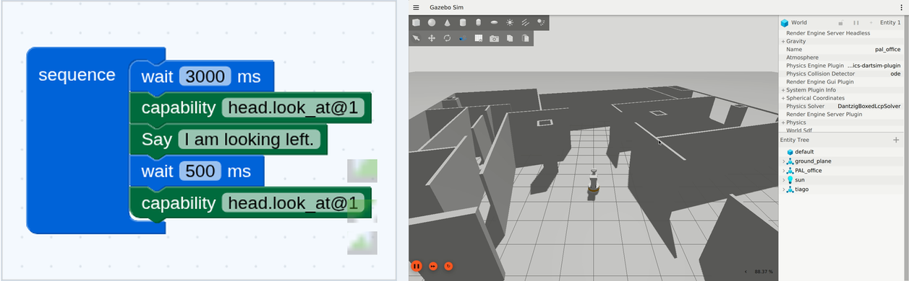

# RoboArc

**Robot Action Representation & Composition**

Build robot workflows visually, then run the same typed Workflow IR against a
mock adapter, deterministic simulation, or a robot integration proof.

RoboArc keeps Blockly editor state, workflow semantics, and robot transport
details separate. The browser authoring surface compiles to a small,
versioned Workflow IR with `sequence`, `wait`, and `capability` nodes.

<p><a href="https://miaodx.com/roboarc/?review=tiago-look-and-say"><strong>Open the TIAGo &quot;Look and say&quot; demo -&gt;</strong></a></p>

<p align="center">
  <a href="https://miaodx.com/roboarc/?review=tiago-look-and-say">
    
  </a>
</p>

The image pairs the canonical Blockly workflow with a robot-side view from the
same proof. Click it to open the full [TIAGo "Look and say" demo](https://miaodx.com/roboarc/?review=tiago-look-and-say).

## Demos

- [TIAGo: Look and say](https://miaodx.com/roboarc/?review=tiago-look-and-say)
- [TIAGo: Reception greeting](https://miaodx.com/roboarc/?review=tiago-proof-final)
- [TIAGo: Observable reception greeting](https://miaodx.com/roboarc/?review=tiago-observable)
- [Reachy: Welcome gesture](https://miaodx.com/roboarc/?review=reachy-proof-final)
- [Mock runtime](https://miaodx.com/roboarc/?review=mock-demo)
- [Deterministic simulation](https://miaodx.com/roboarc/?review=simulation-observable)

## Run locally

RoboArc requires Python 3.11+ and Node.js for the Web workbench.

```bash
python -m venv .venv
source .venv/bin/activate
python -m pip install -e ".[dev]"
python -m pytest
```

Start the runtime API in one terminal:

```bash
roboarc serve --host 127.0.0.1 --port 8000
```

Start the Web workbench in another:

```bash
cd web
npm ci
npm run dev
```

Open `http://127.0.0.1:5173` to author and run a workflow. To inspect the
recorded catalog locally instead:

```bash
./scripts/serve_review.sh --host 0.0.0.0 --artifacts artifacts
```

Then open `http://127.0.0.1:5173/?review`.

## What is here

- A typed Workflow IR and generated JSON Schemas.
- A deterministic Python runtime with validation, events, deadlines, timeout,
  and truthful cancellation semantics.
- A React/Blockly workbench with capability discovery, project import/export,
  validation, run controls, and runtime telemetry.
- Observable Mock and simulation runs plus ROS 2, TIAGo Gazebo, and Reachy
  integration proofs that use the same workflow boundary.

## Human documentation

- [User guide](docs/human/guide.md) — local setup, workbench, demos, and proof
  lanes.
- [Architecture](docs/architecture.md) — layer boundaries and runtime shape.
- [Workflow IR](docs/workflow-ir.md) — canonical document format and examples.
- [Runtime semantics](docs/runtime.md) — events, timeouts, cancellation, and
  adapter behavior.

## License

MIT
