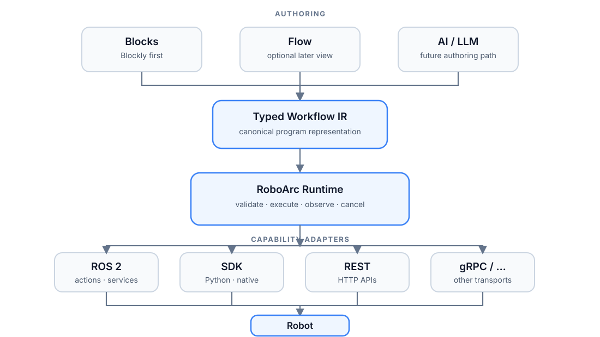

# Architecture

RoboArc is a small visual-programming framework for composing robot behavior from reusable capabilities. Its primary boundary separates **how a workflow is authored**, **what the workflow means**, and **how a robot executes it**.



## Goals

- Provide a friendly Web authoring experience, beginning with Blockly.
- Keep typed, editor-neutral Workflow IR as the canonical program representation.
- Expose robot functionality through stable capabilities rather than transport-specific APIs.
- Support heterogeneous interfaces such as ROS 2, SDKs, REST, gRPC, and WebSocket.
- Make execution observable through state, progress, result, error, log, timeout, and cancellation contracts.
- Allow a workflow to run on different profiles only when capability semantics are compatible.
- Keep the core small, testable, and embeddable.

## Non-goals

RoboArc v0.x is not intended to be:

- a replacement for ROS 2, Nav2, MoveIt 2, or vendor SDKs;
- a hard real-time or safety-certified controller;
- a general-purpose Python/JavaScript execution sandbox;
- a fleet-management, account, collaboration, or marketplace platform;
- a promise that every capability is portable across every robot.

## System boundaries

```text
Authoring
  React shell + Blockly       Flow UI (later)       AI/LLM (later)
      \              |                   /
       +-------------+------------------+
                     |
                     v
                Workflow IR
                     |
              validate / execute
                     |
                     v
               RoboArc Runtime
                     |
              Capability Contract
                     |
          +----------+----------+
          |          |          |
        ROS 2       SDK        REST / gRPC / ...
          |          |          |
          +----------+----------+
                     |
                   Robot
```

### Authoring layer

The React workbench owns the browser workflow and embeds Blockly as its visual
editor. Blockly workspace serialization is UI state, not executable source of
truth. The deterministic compiler maps supported blocks to validated Workflow
IR; future node graphs or AI-assisted paths must use the same IR boundary.

### Workflow IR

Workflow IR captures behavior semantics without depending on Blockly, ROS, or a specific robot. The implemented core starts with `sequence`, `wait`, and `capability`. Conditions, references, loops, parallelism, retry, fallback, and subflows are deferred until their semantics are fully specified.

### Capability layer

A capability is a product-level behavior such as `navigation.goto_location`, `head.look_at`, or `speech.say`. Its manifest defines an exact contract version, inputs, outputs, execution traits, progress fidelity, and logical resources. A robot profile lists the exact capability contracts available through one adapter/configuration.

### Runtime

The runtime validates and executes Workflow IR, starts adapter invocations, enforces manifest deadlines, propagates cancellation requests, validates successful outputs, and emits ordered structured events.

One adapter profile is selected at process startup and owns the runtime for
that process. The runtime reports this active profile but does not provide a
per-run adapter switch. Before invocation it produces a deterministic,
node-keyed compatibility report. Exact references on the same or unpinned
profile are compatible; cross-profile references require the active manifest
to explicitly name the source profile. Missing IDs, version mismatches, and
undeclared cross-profile semantics are reported separately and block the run.

The current implementation uses Python, `asyncio`, Pydantic, FastAPI, HTTP, and WebSocket. The runtime core imports no ROS-specific types.

### Robot adapters

An adapter translates a capability invocation into a native operation. A single profile may mix transports—for example, navigation through a ROS 2 Action, speech through REST, and manipulation through a vendor SDK.

Adapters translate both calls and lifecycle semantics. They must distinguish cancellation request acceptance from confirmed terminal cancellation and normalize native feedback/errors without hiding uncertainty.

## Current executable slice

```text
Workflow JSON
    |
    v
Pydantic contracts + deterministic validation
    |
    v
asyncio Runtime ---- ordered EventStream ---- HTTP/WebSocket clients
    |
    v
CapabilityInvocation lifecycle
    |
    v
MockAdapter / DeterministicSimulationAdapter
```

The simulation adapter produces backend-neutral pose, trajectory, action-state,
and progress observations. Runtime events and robot observations share
run/node/invocation identity and timestamps, then export to JSONL or an optional
native Rerun recording. ROS/TIAGo translation remains in the separate manual
proof lane under `tests/tiago`; no ROS imports enter the contracts or runtime.

The Web editor consumes the same JSON Schemas and API rather than introducing a
second execution model. It uses HTTP for discovery, validation, snapshots, and
run control, and a reconnecting WebSocket client for replay and live events.

## Communication

The browser-facing v0.1 boundary is:

- HTTP for health, profile/capability discovery, validation, run control, snapshots, and event replay;
- WebSocket for live execution events after replaying events missed since `after_seq`.

Adapters remain free to use gRPC, ROS 2, REST, or other interfaces internally.

## Security boundary

Workflows are declarative and strict. They cannot execute arbitrary Python, JavaScript, shell commands, or evaluated expressions. Capability handlers are trusted installed code; workflows may invoke only capabilities exposed by the active profile.

Authentication and multi-user authorization are deferred, and the development server binds to localhost by default. Robot safety remains the responsibility of robot controllers and safety systems rather than this workflow layer.

## Portability boundary

Capability names alone do not guarantee semantic equivalence. The optional
v1 manifest `compatible_profiles` field makes only a narrow, explicit claim
about an exact capability version. Absent declarations remain `unknown` rather
than inferred compatible. Richer dimensions such as frames, units, maps,
preconditions, payload/workspace constraints, timing, cancellation, and result
semantics are not inferred by the runtime.

RoboArc therefore aims for:

> Compose against shared capabilities; run where compatible.

It does not claim “write once, run everywhere.”

## Future extensions

The architecture leaves room for, but does not require in the current core:

- alternative graph-oriented and AI-assisted authoring surfaces;
- typed values, references, conditions, and bounded loops;
- `parallel_all`, resource arbitration, and pre/postconditions;
- reusable subflows;
- retry/fallback with side-effect and retry-safety semantics;
- durable execution and state reconciliation;
- timeline, replay, and provenance;
- natural-language proposals compiled to validated Workflow IR and visually reviewed;
- a hardened Rust edge runtime if deployment requirements justify it.
